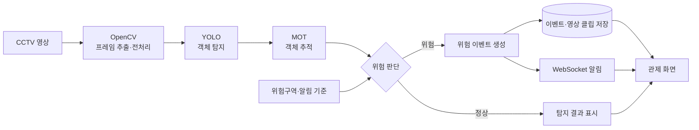
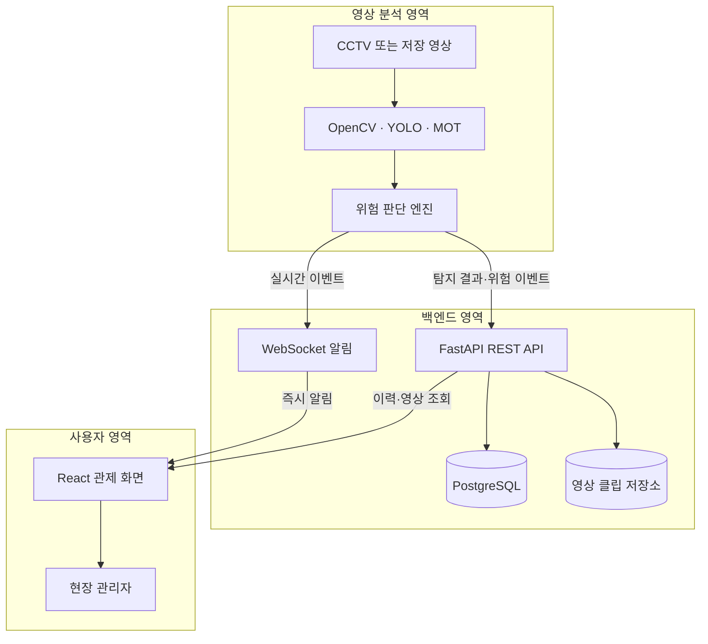

# 지능형 CCTV 기반 산업현장 안전관제 시스템

> 종합설계프로젝트2 · CCTV 영상 분석을 통한 산업현장 안전관리 지원

**현재 단계:** 요구사항 및 문서 정리 · **구현 상태:** 개발 예정

## 목차

- [프로젝트 소개](#프로젝트-소개)
- [개발 범위](#개발-범위)
- [개발 목표](#개발-목표)
- [주요 기능](#주요-기능-개발-예정)
- [처리 흐름](#처리-흐름-예정)
- [개발 현황](#개발-현황)
- [데이터셋 선정 검토](#데이터셋-선정-검토)
- [개발 로드맵](#개발-로드맵)
- [검증 계획](#검증-계획)
- [개발 전 결정할 사항](#개발-전-결정할-사항)
- [저장소 구성](#저장소-구성)
- [설치 및 실행](#설치-및-실행)
- [협업 가이드](#협업-가이드)
- [팀원](#팀원)

## 프로젝트 소개

산업현장의 CCTV 영상을 분석하여 작업자와 지게차를 우선 인식하고,
사람–장비 충돌 위험과 위험구역 침입 등 위험 상황을 탐지하는 안전관제 시스템을 개발합니다.
탐지 결과를 알림과 관제 화면으로 제공하여 관리자가 현장 상황을 파악하고 대응할 수 있도록 돕는 것을 목표로 합니다.

초기 구현은 작업자–지게차 위험 탐지에 집중합니다. 이후 데이터 확보와 개발 진척에 따라 크레인,
개인보호구(PPE) 착용 여부, 크레인 인양물 위험 탐지로 범위를 확장합니다.

## 개발 범위

기능을 한 번에 모두 구현하기보다 핵심 안전 시나리오를 먼저 완성하고 단계적으로 확장합니다.

| 구분 | 탐지 대상 및 기능 | 완료 기준 | 우선순위 |
| --- | --- | --- | --- |
| 1차 구현 | 작업자·지게차 탐지 및 추적 | 테스트 영상에서 객체별 ID와 위치를 연속 표시 | 필수 |
| 1차 구현 | 위험구역 진입 판단 | 작업자의 기준점이 지정 구역에 진입하면 이벤트 생성 | 필수 |
| 1차 구현 | 관제 화면 및 알림 | 탐지 영상, 위험 유형, 발생 시각과 구역을 화면에 표시 | 필수 |
| 고도화 | 작업자–지게차 접근 위험 | 거리와 이동 방향을 이용해 위험 단계를 구분 | 우선 확장 |
| 고도화 | PPE 착용 여부 | 작업자별 안전모·안전조끼 착용 상태 표시 | 확장 검토 |
| 고도화 | 크레인·인양물 위험 | 인양물 주변 작업자 접근 또는 체류 상황 탐지 | 확장 검토 |

### 활용 시나리오

1. 관리자가 분석할 CCTV 영상과 위험구역을 설정합니다.
2. 시스템이 영상에서 작업자와 지게차 등 대상 객체를 탐지하고 추적합니다.
3. 객체 간 거리 또는 위험구역 진입 여부를 바탕으로 위험 이벤트를 생성합니다.
4. 관리자는 관제 화면에서 탐지 결과와 알림을 확인하고 현장 상황을 점검합니다.

위 시나리오는 목표 동작이며, 입력 방식과 위험 판단 기준은 개발 과정에서 구체화할 예정입니다.

## 개발 목표

- **사람–장비 위험 탐지**: 작업자와 지게차를 탐지·추적하여 충돌 위험을 판단합니다.
- **작업자 안전 상태 확인**: 개인보호구 착용 상태를 인식하는 확장 기능을 검토합니다.
- **위험 상황 탐지**: 작업자의 위험구역 침입과 크레인 인양물 주변 위험을 단계적으로 감지합니다.
- **관제 및 대응 지원**: 위험 상황을 알리고 탐지 결과를 관제 화면에서 확인할 수 있도록 합니다.

## 주요 기능 (개발 예정)

| 기능 | 설명 |
| --- | --- |
| 영상 입력 및 처리 | CCTV 영상을 입력받아 분석에 필요한 형태로 처리 |
| 객체 탐지·추적 | YOLO와 MOT를 이용해 작업자·지게차를 우선 인식하고 이동 경로 추적 |
| 위험 판단 | 객체 간 거리와 작업자 위치를 바탕으로 충돌 위험 및 위험구역 침입 여부 판단 |
| 위험 상황 알림 | 감지된 위험 상황을 관리자에게 전달 |
| 관제 화면 | 영상과 탐지 결과를 확인할 수 있는 화면 제공 |

## 처리 흐름 (예정)

```text
CCTV 영상 입력 → OpenCV 전처리 → YOLO 탐지·MOT 추적 → 위험 판단 → API·저장 → 알림 및 관제
```



각 단계의 역할은 다음과 같이 구분할 예정입니다. 아래 항목은 설계 초안이며, 실제 모듈과 인터페이스는 구현 시 확정합니다.

| 단계 | 주요 역할 | 다음 단계에 전달할 정보 |
| --- | --- | --- |
| 영상 입력 및 처리 | 영상 읽기와 분석할 프레임 준비 | 프레임, 영상 식별 정보, 프레임 시각 |
| 객체 탐지·추적 | 작업자와 지게차의 종류·위치·이동 경로 추정 | 객체 ID, 종류, 탐지 영역, 신뢰도 |
| 위험 상황 판단 | 객체 간 거리 및 설정된 위험구역과 탐지 위치 비교 | 위험 유형, 위험도, 발생 시각, 해당 구역 |
| API 및 저장 | 위험 이벤트와 관련 영상 클립을 기록하고 실시간 메시지 전달 | 이벤트 JSON, 영상 위치, 알림 메시지 |
| 알림 및 관제 | 탐지 결과 표시와 위험 이벤트 전달 | 관리자가 확인할 영상 및 이벤트 정보 |

## 개발 현황

현재 프로젝트 소개와 문서를 정리하는 초기 단계입니다.
위 기능과 처리 흐름은 개발 계획이며, 구현 진행에 따라 업데이트합니다.

| 항목 | 계획 및 상태 |
| --- | --- |
| 객체 탐지 모델 | YOLO 기반 작업자·지게차 탐지를 우선 개발하고 MOT 추적기 연동 검토 |
| 데이터셋 | AI Hub와 Roboflow 공개 데이터를 우선 조사하고 부족한 클래스는 합성 데이터로 보완 검토 |
| 기술 스택 | OpenCV·YOLO/MOT·FastAPI·PostgreSQL·React를 중심으로 초기 구조 수립 |
| 프로젝트 구조 | 모듈 구성 및 폴더 구조 협의 예정 |
| 설치 및 실행 | 실행 코드와 개발 환경 확정 후 안내 예정 |

### 아키텍처 초안

| 계층 | 후보 기술 | 역할 |
| --- | --- | --- |
| 영상 처리 | OpenCV | CCTV 영상 입력, 프레임 추출 및 전처리 |
| AI 분석 | YOLO + ByteTrack 등 MOT | 작업자·장비 탐지, 객체 추적 및 위험 판정 |
| 백엔드 | FastAPI + WebSocket | 이벤트 API와 실시간 알림 제공 |
| 저장 | PostgreSQL + 로컬/S3 | 이벤트 메타데이터와 관련 영상 클립 저장 |
| 관제 화면 | React | 실시간 탐지 결과, 알림, 이벤트 이력 표시 |



초기 검증은 저장 영상과 로컬 환경을 사용합니다. 통합 단계에서 Docker 컨테이너화와
AWS EC2·S3·RDS 배포 여부를 결정합니다. 탐지 기능은 하나의 모델에 모두 결합할 필요 없이,
사람·장비 탐지 모델과 PPE·인양물 탐지 모델처럼 목적별 복수 모델로 구성할 수 있습니다.

## 데이터셋 선정 검토

**현재 상태: 후보 검토 중이며, 사용할 데이터셋과 최종 클래스는 샘플 확인 후 확정합니다.**
우선순위는 작업자와 지게차이며, 크레인·PPE·인양물 관련 데이터는 확장 범위로 검토합니다.

| 후보 | 구성 및 장점 | 검토할 한계 |
| --- | --- | --- |
| [SH17](https://github.com/ahmadmughees/SH17dataset) | 산업현장 이미지 8,099장, 17개 클래스. 사람·안전모·안전조끼 등을 포함하며 YOLO 학습 설정 제공 | 명시적인 미착용 클래스가 없어 사람과 보호구를 연결하는 착용 판단 로직 필요. 사진 기반이므로 CCTV 영상에서 별도 검증 필요. CC BY-NC-SA 4.0 및 원본 이미지 이용 조건 확인 |
| [AI Hub — 건설 현장 위험 상태 판단 데이터](https://aihub.or.kr/aihubdata/data/view.do?currMenu=115&topMenu=100&dataSetSn=71407) | 이미지 226,000장. 작업자·굴삭기·지게차·안전시설물과 정상·위험 시나리오 포함 | 공개 클래스 목록에 안전모·안전조끼·미착용 클래스 없음. 상황은 바운딩박스, 객체는 세그멘테이션으로 라벨링되어 YOLO 탐지용 변환 필요. 이미지 약 274GB로 필요한 부분 선별 검토 |
| Roboflow 공개 데이터 | 객체 탐지용 데이터셋을 클래스·라이선스별로 빠르게 비교 가능 | 품질과 라벨 기준이 데이터셋마다 다르므로 샘플 검수와 이용 조건 확인 필요 |
| Unity/Unreal 합성 데이터 | 부족한 장비·PPE 클래스와 다양한 카메라 각도·조명 조건 보완 가능 | 도메인 차이로 실제 CCTV 성능이 낮아질 수 있어 실영상 검증 필요 |

AI Hub 후보는 객체의 존재와 배치에 따른 위험 상태 판단용이며, 사고 동작 자체를 학습하는 데이터는 아닙니다.
촬영 장비도 고프로·휴대폰이 대부분이고 이동형 CCTV 비율은 약 0.61%이므로, 실제 CCTV 환경에서의 성능은 별도로 확인해야 합니다.
위 구성과 수치는 각 후보의 공식 소개를 기준으로 정리했으며, 샘플 라벨과 다운로드 가능 파일은 선정 전에 확인할 예정입니다.

### 팀 논의 및 선정 기준

- **기능 우선순위**: 보호구 착용 확인이 중심이면 SH17, 작업자·중장비 주변 위험 판단이 중심이면 AI Hub 후보를 우선 검토합니다. 중장비 탐지는 범위 확장안이며 확정 기능이 아닙니다.
- **구현 가능성**: 샘플 이미지와 라벨을 확인하고, 필요한 클래스 수·변환 작업량·저장공간·학습 장비를 비교합니다. 처음부터 전체 데이터나 두 후보의 통합을 전제하지 않습니다.
- **위험구역 판단**: 관리자가 구역을 지정하는 경우 사람 탐지·추적 결과와 구역 좌표를 비교하는 방식으로 시작할 수 있습니다. 진입 시점 검증용 영상은 별도로 확보합니다.
- **평가 계획**: 탐지 정확도뿐 아니라 위험 판단의 오탐·미탐, FPS, 알림 지연을 비교합니다. 같은 원본 영상의 프레임이 학습·평가에 섞이지 않도록 하고, 가능한 경우 현장 단위로 분리합니다.
- **이용 조건**: 출처 표기, 라이선스, AI Hub 신청·다운로드 조건과 데이터 재배포 가능 범위를 확인합니다.

팀 협의와 샘플 확인 후 선정 이유, 사용할 클래스, 데이터 분할 방식 및 검증 영상 확보 방법을 기록합니다.

## 개발 로드맵

프로젝트는 2026년 9월부터 12월까지 진행합니다. 9월에 요구사항·데이터셋 선정과 1차 모델 개발을
마무리하고, 10월에는 논문 투고 준비 및 백엔드·프론트 개발을 병행하는 순서로 계획합니다.

아래 항목은 앞으로 진행할 작업입니다. 구현과 검증이 끝난 항목부터 체크합니다.

- [ ] **요구사항 정의**: 대상 현장, 인식할 안전장비, 위험구역 진입 기준 정리
- [ ] **데이터셋 선정**: 후보 샘플·이용 조건 비교, 팀 협의 후 데이터셋과 클래스 확정
- [ ] **영상 입력 구성**: 테스트 영상 확보 및 영상 읽기 기능 구현
- [ ] **객체 탐지 구현**: YOLO 모델 선정 및 작업자·안전장비 탐지 결과 확인
- [ ] **위험 판단 구현**: 위험구역 설정 방식과 작업자 위치 기반 판단 로직 개발
- [ ] **관제 기능 연결**: 탐지 결과 표시 및 위험 이벤트 알림 구현
- [ ] **통합 검증**: 시나리오별 동작 확인, 오탐·미탐 사례 분석 및 개선
- [ ] **결과 정리**: 실행 가이드, 시연 자료, 성능 측정 결과 작성

## 검증 계획

단순히 객체가 탐지되는지뿐 아니라, 실제 위험 상황을 구분하고 화면에 전달하는지 확인할 예정입니다.
구체적인 목표 수치는 테스트 환경과 데이터가 정해진 후 설정합니다.

| 검증 항목 | 확인할 내용 |
| --- | --- |
| 작업자·안전장비 탐지 | 대상별 탐지 정확도와 누락 사례 |
| 위험구역 판단 | 구역 밖 이동, 구역 진입, 경계 부근 이동 시 판단 결과 |
| 영상 환경 변화 | 조명 변화, 가림, 여러 작업자가 등장하는 장면에서의 탐지 결과 |
| 처리 성능 | 테스트 장비와 영상 해상도에 따른 처리 속도(FPS) 및 알림 지연 |
| 알림 동작 | 위험 이벤트 전달 여부와 동일 상황의 반복 알림 발생 여부 |

### 1차 시연 완료 기준 (초안)

첫 시연에서는 영상 입력부터 위험 알림까지 하나의 흐름으로 연결되는 것을 목표로 합니다.

- [ ] 준비된 테스트 영상을 읽고 탐지 결과를 화면에 표시할 수 있다.
- [ ] 설정한 위험구역을 화면에서 확인할 수 있다.
- [ ] 구역 밖 이동과 구역 안 진입 사례를 구분해 확인할 수 있다.
- [ ] 위험구역 진입 시 발생 시각과 해당 구역을 알림으로 확인할 수 있다.
- [ ] 사용한 영상, 모델 설정, 실행 환경을 기록해 같은 조건으로 재실행할 수 있다.

### 실험 결과 기록 양식

검증 시 아래 항목을 함께 기록하면 모델이나 설정을 변경한 뒤 결과를 비교하기 쉽습니다.
현재 측정된 결과는 없으며, 수치는 실험 후 작성합니다.

| 기록 항목 | 작성할 내용 |
| --- | --- |
| 실행 조건 | 코드 커밋, 모델·가중치 버전, 탐지 신뢰도 기준 |
| 테스트 입력 | 영상 식별자, 해상도, 길이, 주요 장면 |
| 실행 환경 | CPU·GPU, 메모리, 주요 라이브러리 버전 |
| 위험 판단 설정 | 위험구역 좌표, 진입 기준, 중복 알림 처리 기준 |
| 관측 결과 | 정상 탐지·오탐·미탐 사례와 해당 영상 시각 |
| 처리 성능 | 평균 FPS, 알림 지연, 각 지표의 측정 방법 |
| 개선 사항 | 발견한 문제, 변경할 설정, 재검증 결과 |

## 개발 전 결정할 사항

- **영상 입력**: 저장된 영상과 실시간 CCTV 중 우선 지원할 방식
- **탐지 대상**: [데이터셋 선정 검토](#데이터셋-선정-검토)를 바탕으로 안전장비 종류와 중장비 탐지 확장 여부 결정
- **위험구역 기준**: 구역 설정 방법, 작업자의 진입을 판단할 위치 기준
- **개발 환경**: 모델 버전, 실행 장비, 영상 처리·서버·화면 기술 스택
- **알림 정책**: 알림 전달 방식과 같은 위험 상황에 대한 중복 알림 처리

## 저장소 구성

현재 저장소에는 프로젝트 안내 문서만 포함되어 있습니다.
소스 코드가 추가되면 실제 폴더 구조와 각 모듈의 역할을 함께 문서화합니다.

```text
.
└── README.md    # 프로젝트 소개, 개발 계획 및 팀 구성
```

## 설치 및 실행

현재 실행 가능한 코드는 없습니다. 첫 구현이 추가되면 아래 내용을 기준으로 실행 가이드를 작성할 예정입니다.

1. 필요한 실행 환경과 라이브러리 설치 방법
2. 모델 가중치 및 테스트 영상 준비 방법
3. 영상 입력 경로와 위험구역 설정 방법
4. 프로그램 실행 명령과 결과 확인 방법

## 협업 가이드

### 브랜치에서 변경하고 PR로 공유하기

아래는 작업 브랜치의 변경 사항을 공유하는 기본 절차입니다.
브랜치명과 커밋 메시지는 실제 작업 내용에 맞게 작성합니다.

1. `git branch --show-current`로 현재 작업 브랜치를 확인합니다.
2. 파일을 수정하고 저장한 뒤 `git diff`로 변경 내용을 확인합니다.
3. 변경한 파일을 지정해 커밋하고 작업 브랜치를 원격 저장소에 푸시합니다.
4. 팀에 변경 사항을 공유할 준비가 되면 GitHub에서 PR을 생성합니다.

README 수정 작업의 커밋·푸시 예시:

```bash
git add README.md
git commit -m "docs: README 협업 가이드 보완"
git push -u origin HEAD
```

위 명령은 현재 브랜치를 원격에 올립니다. PR 생성과 병합은 별도 단계입니다.
GitHub에서 PR을 만들 때는 **base: `main`**, **compare: 작업 브랜치**를 확인합니다.
PR을 생성한 뒤에도 병합 전까지 변경 사항은 `main`에 반영되지 않습니다.

### 변경 사항을 공유할 때 적을 내용

- **변경 목적**: 어떤 문제를 해결하거나 내용을 보완했는지
- **주요 변경**: 추가·수정한 기능 또는 문서 내용
- **확인 결과**: 실행이나 검토한 내용, 아직 확인하지 못한 부분

문서에는 구현된 기능과 개발 계획을 구분해 표시합니다.
모델, 실행 방법, 폴더 구성이 변경되면 관련 안내도 함께 갱신합니다.

## 팀원

| 구분 | 이름 | 주 담당 |
| --- | --- | --- |
| 학부생 | 김근찬 | AI 탐지 모델 |
| 학부생 | 조해민 | 백엔드·서버 |
| 학부생 | 서성윤 | 프론트엔드·관제 화면 |
| 대학원생 | 양영준·박주환·김채현 | 프로젝트 자문 및 협업 |
| 기업 멘토 | 손희문 부장 | 산업현장 요구사항 및 방향 자문 |

각 트랙에는 주 담당자를 두되, 모델·서버·관제 화면의 통합이 필요한 작업은 팀원들이 중복 참여합니다.
