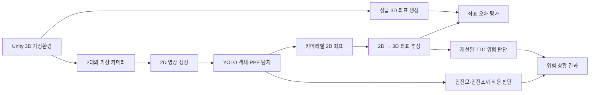

# Unity 가상환경 기반 산업현장 위험물 및 안전장비 탐지

> 종합설계프로젝트2 · 2D CCTV 영상과 3D 가상환경을 연계한 산업현장 안전 탐지 연구

**현재 단계:** 연구 방향 구체화 및 관련 모델 조사 · **구현 상태:** 개발 예정

## 프로젝트 개요

본 프로젝트의 목표는 실제 산업현장에서 위험물과 작업자의 안전장비 착용 상태를 더 빠르고 정확하게 탐지하는 것입니다.

실제 산업현장은 3차원 공간이지만 CCTV 영상은 2차원입니다. 영상에서 얻은 2D 좌표만으로는 객체 사이의 실제 거리와 위치를 정확히 판단하기 어렵습니다. 이를 해결하기 위해 Unity로 실제 현장과 유사한 3D 가상환경을 구축하고, 두 대의 가상 카메라로 CCTV 영상을 모사합니다. 가상환경에서 확보한 2D–3D 좌표 관계를 이용해 실제 CCTV 환경에 적용할 수 있는 좌표 추정 및 위험 탐지 방법을 연구합니다.

또한 공사 현장용 YOLO 객체 인식 모델을 조사하고, 작업자의 안전모 및 안전조끼 착용 여부를 구분하는 방향으로 탐지 주제를 확장합니다.

## 연구 배경 및 문제 정의

### 실제 환경과 CCTV 영상의 차이

- 실제 산업현장은 깊이와 거리를 포함하는 **3D 공간**입니다.
- 일반 CCTV 영상에서 직접 얻는 정보는 픽셀 단위의 **2D 좌표**입니다.
- 2D 좌표만으로 실제 위치와 거리를 계산하면 원근, 카메라 각도, 가림 등에 의해 오차가 발생할 수 있습니다.
- 위험 판단에 필요한 실제 현장 영상과 정답 3D 좌표 데이터를 충분히 확보하기 어렵습니다.

### 핵심 연구 문제

1. 실제 환경 데이터가 부족한 상황에서 학습 및 검증 데이터를 어떻게 확보할 것인가?
2. CCTV 영상에서 탐지한 2D 좌표를 3D 공간 좌표로 얼마나 빠르고 정확하게 변환할 수 있는가?
3. 기존 TTC(Time To Collision) 방식의 한계를 보완해 위험 상황을 더 정확하게 판단할 수 있는가?
4. 안전모 및 안전조끼 착용 여부를 실제 공사 현장 영상에서 안정적으로 구분할 수 있는가?

## 제안 방법

### 1. Unity 기반 3D 가상환경 구축

기업 멘토에게 제공받은 환경 자료를 참고해 실제 산업현장과 최대한 유사한 3D 공간을 Unity로 구축합니다. 작업자, 위험물, 안전장비와 현장 구조물을 배치하고 위치, 거리, 카메라 시점, 조명 등을 바꾸어 다양한 상황을 생성합니다.

### 2. 두 대의 Unity 카메라를 이용한 CCTV 모사

Unity 가상환경에 두 대의 카메라를 설치해 실제 CCTV 촬영 상황을 모사합니다. Unity에서는 객체의 3D 좌표와 각 카메라 영상의 2D 좌표를 함께 얻을 수 있으므로 다음 데이터를 자동으로 구성할 수 있습니다.

- 객체 종류 및 식별 정보
- 실제 3D 좌표
- 카메라별 2D 영상 좌표와 바운딩박스
- 카메라 위치, 방향 및 내부·외부 파라미터
- 객체 간 실제 거리와 충돌 예상 정보

### 3. 2D 좌표에서 3D 좌표 추정

YOLO로 영상 속 객체를 탐지한 뒤, 두 카메라에서 얻은 2D 좌표를 이용해 3D 위치를 추정합니다. Unity가 제공하는 2D–3D 대응 관계는 좌표 추정 결과를 학습하고 평가하기 위한 기준 데이터로 사용합니다.

우선 카메라 캘리브레이션과 스테레오 기하 기반 좌표 복원을 구현하고, 시간과 데이터가 충분하면 2D 좌표에서 3D 좌표를 직접 추정하는 학습 기반 방법도 비교합니다.

### 4. YOLO 기반 객체 및 안전장비 탐지

공사 현장에 적합한 YOLO 모델과 공개 데이터셋을 조사해 다음 항목의 탐지 가능성을 검토합니다.

- 작업자
- 산업현장 위험물 또는 위험 객체
- 안전모 착용 / 미착용
- 안전조끼 착용 / 미착용

안전모와 안전조끼는 화면에 존재하는지만 확인하지 않고, 탐지된 작업자와 보호구를 연결해 **작업자별 착용 여부**를 판단하는 것을 목표로 합니다.

### 5. TTC 기반 위험 판단 개선

기존 TTC 방식은 영상 좌표나 단순 거리 변화에 의존하면 원근과 카메라 시점의 영향을 받을 수 있습니다. 추정한 3D 위치, 객체 간 실제 거리, 이동 속도와 방향을 함께 사용해 TTC 기반 위험 판단 알고리즘을 개선합니다.

ABB 사업과 연계해 수학과와 공동 연구를 진행하고, 좌표 변환과 위험도 계산에 필요한 수학적 모델에 대한 도움을 받아 기존 방식의 정확도와 계산 효율을 개선할 계획입니다.

## 전체 처리 흐름



## 주요 개발 범위

| 구분 | 내용 | 우선순위 |
| --- | --- | --- |
| 가상환경 | 멘토 제공 자료를 참고한 Unity 산업현장 구축 | 필수 |
| 카메라 구성 | 두 대의 Unity 카메라로 CCTV 환경 모사 | 필수 |
| 데이터 생성 | 객체별 2D 좌표와 정답 3D 좌표 수집 | 필수 |
| 객체 탐지 | 공사 현장에 적합한 YOLO 모델 조사 및 적용 | 필수 |
| PPE 탐지 | 안전모·안전조끼 착용/미착용 구분 | 필수 |
| 좌표 복원 | 두 영상의 2D 좌표를 이용한 3D 좌표 추정 | 필수 |
| 위험 판단 | 3D 좌표를 이용한 TTC 방식 개선 | 필수 |
| 좌표 학습 | 학습 기반 2D→3D 좌표 추정 방법 비교 | 추가 검토 |

## 연구 및 개발 계획

- [ ] 멘토 제공 환경 자료 분석 및 Unity 현장 구성 요소 정의
- [ ] Unity 3D 가상환경 구축
- [ ] 두 대의 가상 카메라 위치와 촬영 조건 설정
- [ ] Unity 객체의 3D 좌표 및 카메라별 2D 좌표 수집
- [ ] 공사 현장용 YOLO 객체 인식 모델 조사 및 비교
- [ ] 안전모·안전조끼 착용/미착용 탐지 모델 및 데이터셋 조사
- [ ] 작업자와 안전장비 탐지 결과를 연결하는 착용 판단 로직 설계
- [ ] 카메라 캘리브레이션 및 2D→3D 좌표 복원 구현
- [ ] 좌표 추정 정확도와 처리 속도 측정
- [ ] 3D 위치 기반 TTC 위험 판단 알고리즘 설계 및 개선
- [ ] Unity 가상환경에서 전체 파이프라인 검증
- [ ] 시간이 허용되면 학습 기반 2D→3D 좌표 추정 방법 구현 및 비교

## 모델 및 데이터셋 선정 기준

공사 현장용 YOLO 모델과 PPE 데이터셋은 다음 기준으로 비교한 뒤 선정합니다.

| 평가 항목 | 확인 내용 |
| --- | --- |
| 탐지 클래스 | 작업자, 위험물, 안전모와 안전조끼의 착용/미착용 구분 여부 |
| 현장 적합성 | 공사 현장, CCTV 시점, 소형 객체 및 가림 상황 포함 여부 |
| 정확도 | 클래스별 Precision, Recall, mAP 및 미탐·오탐 사례 |
| 처리 속도 | 목표 장비에서의 FPS와 프레임당 추론 시간 |
| 라벨 품질 | 작업자와 PPE의 대응 관계 및 착용 상태 라벨의 일관성 |
| 이용 조건 | 라이선스, 출처 표기, 수정 및 재배포 가능 범위 |

최종 모델과 데이터셋은 후보 조사 및 샘플 검증 이후 확정하며, 현재 README에는 특정 모델의 성능을 확정값으로 기재하지 않습니다.

## 검증 계획

| 검증 항목 | 주요 지표 |
| --- | --- |
| 객체 탐지 | Precision, Recall, mAP, 클래스별 오탐·미탐 |
| PPE 착용 판단 | 안전모·안전조끼 착용/미착용 분류 정확도 |
| 3D 좌표 추정 | Unity 정답 좌표 대비 위치 오차 및 거리 오차 |
| 처리 성능 | 전체 FPS, 탐지 시간, 좌표 복원 시간, 위험 판단 지연 |
| TTC 위험 판단 | 위험/정상 시나리오의 정확도, 오탐률 및 미탐률 |
| 환경 변화 대응 | 카메라 각도, 거리, 조명, 가림 변화에 따른 성능 |

비교 실험에서는 2D 좌표 기반 기존 TTC 방식과 3D 좌표를 사용하는 개선 방식을 같은 시나리오에 적용해 정확도와 처리 시간을 비교합니다. 가상환경에서 성능을 확인한 뒤 실제 영상에 적용할 때 발생하는 도메인 차이도 별도로 기록합니다.

## 기대 효과 및 고려사항

- Unity를 통해 실제 현장 데이터 부족을 보완하고 다양한 실험 상황을 생성할 수 있습니다.
- 두 CCTV 영상으로 3D 위치를 복원해 실제 거리 기반 위험 판단이 가능해집니다.
- 3D 좌표를 활용해 기존 TTC 방식의 원근 오차를 줄일 수 있습니다.
- 안전모와 안전조끼 착용 여부를 함께 확인해 안전관리 범위를 확장할 수 있습니다.
- Unity와 실제 CCTV 사이의 도메인 차이, 카메라 동기화와 캘리브레이션 오차를 검증해야 합니다.
- 시스템 결과는 현장 관리자의 판단을 지원하며 단독으로 안전을 보장하지 않습니다.

## 저장소 구성 및 실행

현재 저장소에는 프로젝트 안내 문서만 포함되어 있으며 실행 가능한 코드는 없습니다. 구현이 시작되면 Unity 프로젝트 구조, Python 환경, YOLO 모델 준비 방법, 데이터 생성 및 실험 실행 절차를 추가합니다.

```text
.
└── README.md    # 연구 주제, 제안 방법 및 개발 계획
```

## 팀원

| 구분 | 이름 | 주 담당 |
| --- | --- | --- |
| 학부생 | 김근찬 | AI 탐지 모델 및 좌표 추정 |
| 학부생 | 조해민 | 시스템 연동 및 데이터 처리 |
| 학부생 | 서성윤 | Unity 가상환경 및 결과 시각화 |
| 대학원생 | 양영준·박주환·김채현 | 프로젝트 자문 및 협업 |
| 기업 멘토 | 손희문 부장 | 산업현장 환경 자료 및 요구사항 자문 |

세부 역할은 구현 범위와 공동 연구 진행 상황에 따라 조정합니다.
