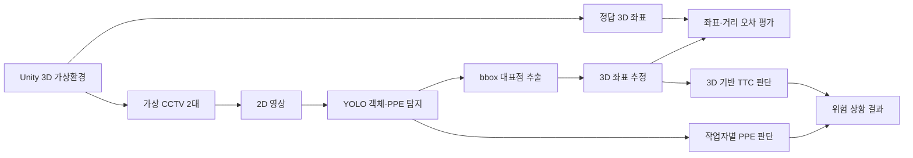

# Unity 가상환경 기반 산업현장 안전 탐지

> 2D CCTV 영상과 3D 가상환경을 연계한 위험물·개인보호구(PPE) 탐지 연구


## 한눈에 보기

산업현장의 CCTV 영상에서 **작업자·위험물·개인보호구를 탐지**하고, 두 카메라의 2D 바운딩 박스를 이용해 객체의 **3D 위치를 추정**하는 프로젝트입니다. Unity 가상 산업현장에서 추정 좌표와 실제 좌표를 비교하고, 이를 바탕으로 기존 TTC(Time To Collision) 위험 판단 방식의 정확도를 개선합니다.

| 항목 | 내용 |
| --- | --- |
| 프로젝트 | 종합설계프로젝트2 |
| 현재 단계 | 연구 방향 구체화 및 객체 탐지 모델·데이터셋 후보 논의 |
| 구현 상태 | 개발 예정 |
| 핵심 기술 | Unity, YOLO, 스테레오 기하, TTC |
| 탐지 대상 | 작업자, 위험물, 안전모, 안전조끼 |
| 최종 목표 | 3D 실제 거리 기반 산업현장 위험 판단 |

## 목차

- [연구 배경](#연구-배경)
- [핵심 목표](#핵심-목표)
- [시스템 구성](#시스템-구성)
- [연구 범위](#연구-범위)
- [검증 방법](#검증-방법)
- [개발 계획](#개발-계획)
- [저장소 및 실행 안내](#저장소-및-실행-안내)
- [팀 구성](#팀-구성)

## 연구 배경

실제 산업현장은 깊이와 거리를 포함하는 3D 공간이지만, 일반 CCTV 영상에서 직접 얻는 정보는 픽셀 단위의 2D 좌표입니다. 2D 좌표만으로 객체 간 실제 거리와 충돌 가능성을 판단하면 원근, 카메라 각도, 가림 등에 의해 오차가 발생할 수 있습니다.

또한 실제 현장에서 위험 상황을 재현하거나 충분한 정답 3D 좌표 데이터를 확보하기 어렵습니다. 본 프로젝트는 Unity를 이용해 다양한 상황과 정답 데이터를 생성하고, 2D 탐지 결과로부터 3D 위치를 복원해 이 문제를 해결하고자 합니다.

## 핵심 목표

1. **가상 데이터 생성** — Unity 환경에서 영상과 정답 3D 좌표를 함께 수집합니다.
2. **객체 및 PPE 탐지** — 작업자와 위험물을 탐지하고 작업자별 안전모·안전조끼 착용 여부를 판단합니다.
3. **3D 좌표 추정** — 두 카메라의 바운딩 박스와 카메라 파라미터로 객체의 3D 위치를 계산합니다.
4. **위험 판단 개선** — 3D 위치, 실제 거리, 이동 속도와 방향을 활용해 TTC 판단의 정확도를 높입니다.

### 핵심 연구 질문

- 실제 데이터가 부족한 상황에서 학습·검증 데이터를 어떻게 확보할 것인가?
- YOLO의 2D 바운딩 박스로 3D 좌표를 얼마나 빠르고 정확하게 추정할 수 있는가?
- 3D 거리 정보로 기존 2D 기반 TTC 방식의 한계를 줄일 수 있는가?
- 실제 공사 현장 영상에서 작업자별 PPE 착용 여부를 안정적으로 구분할 수 있는가?

## 시스템 구성



| 구분 | 데이터 |
| --- | --- |
| 입력 | 두 카메라의 영상, 카메라 내부·외부 파라미터 |
| 중간 결과 | 객체별 bbox, 대표 2D 좌표, 추정 3D 좌표, PPE 착용 상태 |
| 정답 데이터 | Unity 객체의 실제 3D 좌표와 객체 간 거리 |
| 최종 출력 | 위험 여부, 좌표 오차, 처리 속도, 탐지 성능 |

## 연구 범위

### 1. Unity 가상환경 및 데이터 생성

기업 멘토가 제공한 환경 자료를 참고해 산업현장과 유사한 3D 공간을 구성합니다. 작업자, 위험물, 안전장비 및 현장 구조물을 배치하고 카메라 시점, 거리, 조명, 가림 조건을 바꾸어 다양한 시나리오를 생성합니다.

- 객체 종류와 식별 정보
- 객체의 실제 3D 좌표
- 카메라별 2D 좌표와 바운딩 박스
- 카메라 위치·방향 및 내부·외부 파라미터
- 객체 간 실제 거리와 충돌 예상 정보

### 2. YOLO 기반 객체 및 PPE 탐지

공사 현장에 적합한 YOLO 모델과 공개 데이터셋을 조사하고 있습니다. 현재 AI Hub와 Kaggle의 건설현장·PPE 데이터셋을 후보로 두고 탐지 클래스, 데이터 규모, 라벨 형식, 실제 CCTV 환경과의 유사성 및 라이선스를 비교·논의 중이며, 최종 학습 데이터셋은 아직 확정하지 않았습니다.

보호구의 존재 여부만 확인하지 않고, 탐지된 작업자와 보호구를 연결해 **작업자별 안전모·안전조끼 착용 및 미착용 상태**를 판단합니다.

#### 데이터셋 후보 및 검토 상태

| 출처 | 후보 데이터셋 | 주요 검토 용도 | 상태 |
| --- | --- | --- | :---: |
| AI Hub | 건설 현장 위험 상태 판단 데이터 | 작업자·중장비·위험물 등 공사 현장 객체 탐지 | 논의 중 |
| AI Hub | 고소작업 현장 실시간 영상 데이터 | 안전모 등 안전장구 미착용 탐지 | 논의 중 |
| Kaggle | Construction Site Safety Image Dataset | 작업자별 안전모·안전조끼 착용·미착용 탐지 | 논의 중 |
| Kaggle | Safety Helmet and Vest | 안전모·안전조끼 클래스 보강 | 논의 중 |
| 공개 연구 데이터 | SH17·Construction-PPE 등 | 산업현장 PPE 탐지 및 일반화 성능 보강 | 추가 검토 |

후보 데이터셋의 클래스 체계가 서로 다르므로 `person`, `helmet`, `no_helmet`, `vest`, `no_vest` 등 프로젝트 공통 클래스로 통합할 수 있는지도 함께 검토합니다. 데이터셋 선정 후에는 필요에 따라 JSON 등의 라벨을 YOLO 형식으로 변환하고, Unity 생성 데이터 및 실제 CCTV 표본으로 도메인 차이를 보완할 예정입니다.

### 3. bbox 기반 3D 좌표 추정

YOLO bbox의 중심점 또는 하단 중심점을 대표 좌표로 사용합니다. 두 카메라의 대표 좌표와 카메라 파라미터를 스테레오 기하 기반 알고리즘에 입력해 예상 3D 좌표를 계산합니다. 여건이 허용되면 학습 기반 2D→3D 추정 방법도 비교합니다.

### 4. TTC 기반 위험 판단

추정한 3D 위치와 객체 간 실제 거리, 이동 속도 및 방향을 함께 사용해 충돌 예상 시간을 계산합니다. 동일한 시나리오에서 기존 2D 방식과 개선된 3D 방식을 비교합니다.

ABB 사업과 연계해 수학과와 공동 연구를 진행하며, 좌표 변환과 위험도 계산에 필요한 수학적 모델을 보완할 계획입니다.

### 개발 우선순위

| 구분 | 주요 내용 | 우선순위 |
| --- | --- | :---: |
| 가상환경 | Unity 산업현장 구축 | 필수 |
| 카메라 | 가상 CCTV 2대 구성 및 캘리브레이션 | 필수 |
| 데이터 | 2D 탐지 좌표와 정답 3D 좌표 수집 | 필수 |
| 객체·PPE 탐지 | YOLO 모델 적용 및 보호구 착용 판단 | 필수 |
| 좌표 복원 | 두 영상의 bbox를 이용한 3D 좌표 계산 | 필수 |
| 성능 평가 | 좌표 오차와 전체 처리 속도 측정 | 필수 |
| 위험 판단 | 3D 좌표 기반 TTC 개선 | 필수 |
| 학습 기반 추정 | 학습형 2D→3D 방법 구현 및 비교 | 선택 |

## 검증 방법

| 검증 항목 | 주요 지표 |
| --- | --- |
| 객체 탐지 | Precision, Recall, mAP, 클래스별 오탐·미탐 |
| PPE 판단 | 안전모·안전조끼 착용/미착용 분류 정확도 |
| 3D 좌표 추정 | Unity 정답 좌표 대비 위치·거리 오차 |
| 처리 성능 | 전체 FPS, 탐지·좌표 복원·위험 판단 지연 시간 |
| TTC 위험 판단 | 위험/정상 시나리오 정확도, 오탐률, 미탐률 |
| 환경 변화 대응 | 카메라 각도, 거리, 조명, 가림에 따른 성능 변화 |

모델과 데이터셋은 탐지 클래스, 현장 적합성, 데이터 규모, 정확도, 처리 속도, 라벨 형식·품질 및 라이선스를 기준으로 비교하고 있으며 현재 선정 논의 중입니다. 가상환경 검증 이후 실제 영상에 적용할 때 발생하는 도메인 차이도 별도로 기록합니다.

## 개발 계획

### Phase 1 · 환경 및 데이터

- [ ] 멘토 제공 자료 분석 및 현장 구성 요소 정의
- [ ] Unity 3D 산업현장 구축
- [ ] 가상 카메라 두 대의 위치와 촬영 조건 설정
- [ ] 객체의 3D 좌표와 카메라별 2D 좌표 수집

### Phase 2 · 탐지

- [x] 공사 현장용 YOLO 모델 및 데이터셋 후보 조사
- [ ] 후보 데이터셋 비교 및 최종 학습 데이터셋 선정 *(논의 중)*
- [ ] 데이터셋별 클래스·라벨 형식 통합 방안 확정
- [ ] 안전모·안전조끼 착용/미착용 탐지
- [ ] 작업자와 PPE를 연결하는 착용 판단 로직 설계

### Phase 3 · 좌표 추정

- [ ] bbox 대표점 정의
- [ ] 카메라 캘리브레이션 및 3D 좌표 추정 구현
- [ ] 추정 좌표와 Unity 정답 좌표 비교
- [ ] 좌표 오차와 처리 속도 측정

### Phase 4 · 위험 판단 및 통합 검증

- [ ] 3D 위치 기반 TTC 위험 판단 설계
- [ ] Unity 환경에서 전체 파이프라인 검증
- [ ] 기존 2D 방식과 개선된 3D 방식 비교
- [ ] 학습 기반 2D→3D 추정 방법 비교 *(선택)*

## 기대 효과 및 고려사항

**기대 효과**

- 실제 위험 상황을 재현하지 않고 다양한 실험 데이터를 생성할 수 있습니다.
- 두 CCTV 영상으로 3D 위치를 복원해 실제 거리 기반 위험 판단이 가능합니다.
- 작업자별 안전모·안전조끼 착용 여부까지 안전관리 범위를 확장할 수 있습니다.

**고려사항**

- Unity와 실제 CCTV 영상 사이의 도메인 차이
- 두 카메라의 시간 동기화 및 캘리브레이션 오차
- 소형 객체, 가림, 조명 변화에 따른 탐지 성능 저하
- 시스템 결과는 현장 관리자의 판단을 지원하며 단독으로 안전을 보장하지 않음

## 저장소 및 실행 안내

현재 저장소에는 프로젝트 기획 문서만 있으며 실행 가능한 코드는 아직 없습니다.

```text
.
└── README.md    # 프로젝트 개요, 연구 방법 및 개발 계획
```

구현이 시작되면 Unity 프로젝트 구조, Python 개발 환경, YOLO 모델 준비 방법과 데이터 생성·실험 실행 절차를 추가할 예정입니다.

## 팀 구성

| 구분 | 이름 | 주요 역할 |
| --- | --- | --- |
| 학부생 | 김근찬 | AI 탐지 모델 및 좌표 추정 |
| 학부생 | 조해민 | 시스템 연동 및 데이터 처리 |
| 학부생 | 서성윤 | Unity 가상환경 및 결과 시각화 |
| 대학원생 | 양영준·박주환·김채현 | 프로젝트 자문 및 협업 |
| 기업 멘토 | 손희문 부장 | 산업현장 환경 자료 및 요구사항 자문 |

> 세부 역할은 구현 범위와 프로젝트 진행 상황에 따라 조정될 수 있습니다.
