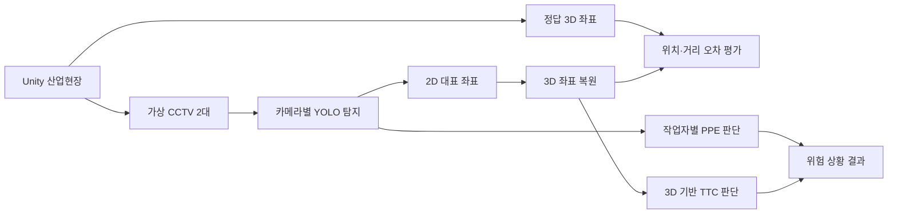

# Unity 가상환경 기반 산업현장 안전 탐지

> Unity로 만든 산업현장을 두 대의 가상 CCTV로 촬영하고, 영상 속 작업자·장비의 3D 위치와 안전장비 착용 여부를 추정하는 연구 프로젝트입니다.

## 목차

- [프로젝트 소개](#어떤-프로젝트인가요)
- [핵심 구성](#무엇을-만드나요)
- [작동 흐름](#작동-흐름)
- [현재 진행 상황](#현재-진행-상황)
- [구현 및 검증](#구현검증-방법)
- [평가 지표](#평가-지표)
- [다음 단계](#다음-단계)
- [개발 환경](#개발-환경)
- [팀 구성](#팀-구성)

## 어떤 프로젝트인가요?

공사 현장의 CCTV 영상만 보면 작업자와 장비가 화면에서 얼마나 가까운지는 알 수 있지만, **실제로 몇 m 떨어져 있는지**는 바로 알기 어렵습니다. 카메라에서 먼 물체는 작게 보이고, 서로 다른 깊이에 있는 물체가 화면에서는 겹칠 수 있기 때문입니다.

이 프로젝트는 Unity 산업현장에 두 대의 가상 CCTV를 설치해 같은 장면을 촬영합니다. YOLO로 영상 속 작업자·위험 요소·개인보호구(PPE)를 찾고, 두 카메라에서 얻은 2D 위치를 이용해 3D 위치를 추정합니다. 추정 결과를 Unity의 실제 좌표와 비교한 뒤, 객체 간 거리와 움직임을 반영한 위험 판단에 활용합니다.

예를 들어 작업자와 이동 장비가 영상에서 가까워 보일 때, 둘의 **실제 거리와 접근 방향**을 계산해 충돌 위험을 판단하는 것이 목표입니다. 동시에 작업자별 안전모·안전조끼 착용 여부도 확인합니다.

## 프로젝트 한눈에 보기

| 항목 | 내용 |
| --- | --- |
| 프로젝트 | 종합설계프로젝트2 |
| 현재 단계 | 가상환경·백엔드 기반 구성, YOLO 모델 및 데이터셋 후보 검토 |
| 핵심 기술 | Unity, YOLO, 스테레오 기하, TTC(Time To Collision) |
| 탐지 대상 | 작업자, 위험물, 안전모, 안전조끼 |
| 최종 목표 | 3D 실제 거리 기반 산업현장 위험 판단 |

## 무엇을 만드나요?

1. **가상 데이터 생성** — Unity 산업현장에서 영상과 정답 3D 좌표 수집
2. **객체·PPE 탐지** — 작업자, 위험물, 안전모 및 안전조끼 착용 여부 탐지
3. **3D 좌표 복원** — 두 카메라에서 같은 객체의 2D 위치와 카메라 파라미터를 이용해 3D 위치 추정
4. **위험 판단 개선** — 객체 간 거리·속도·방향을 반영해 충돌까지 남은 시간(TTC) 계산

## 작동 흐름

| 구분 | 주요 데이터 |
| --- | --- |
| 입력 | 두 카메라 영상, 카메라 내부·외부 파라미터 |
| 중간 결과 | 객체 바운딩 박스, 2D 대표 좌표, 추정 3D 좌표, PPE 착용 상태 |
| 정답 | Unity 객체의 실제 3D 좌표와 객체 간 거리 |
| 출력 | 위험 여부, 좌표 오차, 탐지 성능, 처리 속도 |

## 현재 진행 상황

> **현재 상태:** 구현 및 검증 진행 중

Unity 가상환경과 백엔드 기반 작업을 병행하고 있습니다. YOLO 모델, 최종 데이터셋, 3D 좌표 복원 및 위험 판단 기능은 아직 개발 단계입니다.

백엔드의 FastAPI·PostgreSQL·Docker 구성은 별도 PR에서 검토 중이며, 현재 README에서는 실행 가능한 통합 시스템으로 소개하지 않습니다.

### 데이터셋 및 모델 검토

최종 학습 데이터셋은 아직 확정하지 않았습니다. AI Hub와 Kaggle의 후보를 대상으로 클래스 구성, 데이터 규모, 현장 유사성, 라벨 품질·형식 및 라이선스를 비교하고 있습니다.

| 출처 | 후보 데이터셋 | 검토 용도 | 상태 |
| --- | --- | --- | :---: |
| AI Hub | 건설 현장 위험 상태 판단 데이터 | 작업자·중장비·위험물 탐지 | 논의 중 |
| AI Hub | 고소작업 현장 실시간 영상 데이터 | 안전장구 미착용 탐지 | 논의 중 |
| Kaggle | Construction Site Safety Image Dataset | 안전모·안전조끼 착용·미착용 탐지 | 논의 중 |
| Kaggle | Safety Helmet and Vest | 안전모·안전조끼 데이터 보강 | 논의 중 |
| 공개 연구 데이터 | SH17, Construction-PPE | PPE 탐지 일반화 성능 보강 | 추가 검토 |

선정 후 데이터셋별 클래스를 `person`, `helmet`, `no_helmet`, `vest`, `no_vest` 등의 공통 체계로 통합하고, 필요한 라벨을 YOLO 형식으로 변환할 예정입니다. Unity 및 실제 CCTV 표본을 활용해 공개 데이터셋과 현장 영상 사이의 도메인 차이도 보완합니다.

## 구현·검증 방법

### 객체 및 PPE 탐지

YOLO로 작업자와 보호구를 탐지한 뒤 사람 바운딩 박스와 보호구의 위치 관계를 이용해 작업자별 착용 여부를 판단합니다. 화면에 보호구가 있다는 사실만으로 착용했다고 판정하지 않습니다.

### 3D 좌표 복원

각 바운딩 박스의 중심점 또는 하단 중심점을 대표 좌표로 정하고, 두 카메라에서 **같은 객체를 대응시킨 뒤** 캘리브레이션 파라미터로 3D 위치를 계산합니다. Unity 좌표를 정답으로 사용해 오차를 측정하며, 여건이 허용되면 학습 기반 2D→3D 추정 방법도 비교합니다.

### 위험 판단

연속된 프레임에서 추정한 3D 위치로 객체 간 거리와 접근 속도를 계산해 TTC 기반 위험도를 판단하고, 기존 2D 방식과 비교합니다.

## 평가 지표

| 평가 항목 | 지표 |
| --- | --- |
| 객체 탐지 | Precision, Recall, mAP, 클래스별 오탐·미탐 |
| PPE 판단 | 안전모·안전조끼 착용/미착용 정확도 |
| 3D 좌표 복원 | Unity 정답 대비 위치·거리 오차 |
| 위험 판단 | 정상/위험 분류 정확도, 오탐률, 미탐률 |
| 처리 성능 | FPS 및 단계별 지연 시간 |

## 다음 단계

- [ ] Unity 산업현장 및 가상 CCTV 2대 구성
- [ ] 카메라 캘리브레이션과 정답 좌표 수집
- [x] YOLO 모델 및 공개 데이터셋 후보 조사
- [ ] 최종 데이터셋 선정과 클래스·라벨 형식 통합 *(논의 중)*
- [ ] 작업자·위험물·PPE 탐지 모델 학습
- [ ] 작업자별 PPE 착용 판단 로직 구현
- [ ] 스테레오 기반 3D 좌표 복원 및 오차 평가
- [ ] 3D 기반 TTC 위험 판단 및 전체 시스템 검증
- [ ] 학습 기반 2D→3D 추정 방법 비교 *(선택)*

## 고려사항

- Unity와 실제 CCTV 영상 사이의 도메인 차이
- 두 카메라의 시간 동기화 및 캘리브레이션 오차
- 원거리 소형 객체, 가림 및 조명 변화에 따른 탐지 성능 저하
- 시스템 결과는 현장 관리자의 판단을 지원하며 단독으로 안전을 보장하지 않음

## 개발 환경

기업 멘토가 제공한 Ubuntu 24.04 실습 서버에서 모델 학습과 시스템 개발·검증을 진행합니다. 서버에는 Docker·Docker Compose, Python 3.12, Node.js 24와 기본 개발 도구가 준비되어 있습니다.

서버 접속 정보와 인증 정보는 README에 공개하지 않고 팀 내부의 별도 보안 채널을 통해 공유합니다. 서버는 초기화될 수 있으므로 중요한 코드와 결과물은 Git 등 별도 저장소에 백업하고, 서버 종료 명령은 실행하지 않습니다.

## 팀 구성

| 구분 | 이름 | 주요 역할 |
| --- | --- | --- |
| 학부생 | 김근찬 | AI 탐지 모델 및 좌표 추정 |
| 학부생 | 조해민 | 시스템 연동 및 데이터 처리 |
| 학부생 | 서성윤 | Unity 가상환경 및 결과 시각화 |
| 대학원생 | 양영준·박주환·김채현 | 프로젝트 자문 및 협업 |
| 기업 멘토 | 손희문 부장 | 산업현장 환경 자료 및 요구사항 자문 |

> 세부 역할은 구현 범위와 프로젝트 진행 상황에 따라 조정될 수 있습니다.
