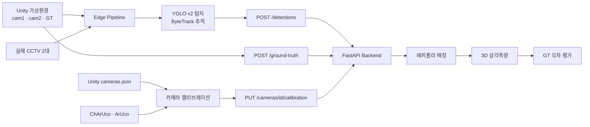

# CCTV Safety

> 두 대의 CCTV 영상에서 객체를 탐지·추적하고, 멀티뷰 기하로 3D 위치를 복원하는 산업현장 안전 모니터링 프로젝트


## Overview

CCTV Safety는 두 카메라의 2D 탐지 결과를 같은 객체끼리 연결하고 삼각측량하여 실제 공간의 3D 위치를 추정합니다. 실제 위험 상황을 반복 재현하기 어려운 문제를 해결하기 위해 Unity를 가상 CCTV 환경으로 사용하며, Unity 정답 좌표와 추정 좌표를 비교해 오차를 측정합니다.

현재 `person`, `chair`, `cart`, `desk` 탐지부터 카메라별 ByteTrack 추적, 서버 전송, 에피폴라 매칭, 3D 삼각측량, Ground Truth 저장까지 연결되어 있습니다. 실제 CCTV 전환을 위한 ChArUco·ArUco 캘리브레이션 도구도 제공합니다.

### 현재 검증 결과

| 항목 | 결과 |
| --- | --- |
| Unity 샘플 | `unity-classroom-01`, 10프레임 |
| 사람 탐지 | cam1 10/10, cam2 6/10 |
| Unity 캘리브레이션 왕복 오차 | 0 mm |
| 양쪽 카메라 탐지 쌍 | 6쌍 |
| 탐지 쌍 에피폴라 거리 | 약 11–22 px |
| 직접 삼각측량 바닥 오차 | 약 20 cm |
| 실제 서버 연동 | calibration, detections, ground-truth HTTP 200/201 |
| 백엔드 자동 테스트 | 8 passed |

> 위 수치는 제한된 Unity 샘플의 중간 검증 결과이며 최종 성능 지표가 아닙니다.

## Architecture


```mermaid
flowchart LR
    U[Unity 가상환경<br/>cam1 · cam2 · GT] --> E[Edge Pipeline]
    C[실제 CCTV 2대] --> E
    E --> Y[YOLO v2 탐지<br/>ByteTrack 추적]
    Y --> D[POST /detections]
    U --> G[POST /ground-truth]
    UC[Unity cameras.json] --> K[카메라 캘리브레이션]
    RC[ChArUco · ArUco] --> K
    K --> P[PUT /cameras/id/calibration]
    D --> B[FastAPI Backend]
    G --> B
    P --> B
    B --> M[에피폴라 매칭]
    M --> T[3D 삼각측량]
    T --> V[GT 오차 평가]
```

1. Unity 폴더 또는 실제 CCTV에서 두 카메라 영상을 가져옵니다.
2. 카메라마다 독립적으로 YOLO 탐지와 ByteTrack 추적을 수행합니다.
3. bbox 하단 중앙을 객체의 바닥 접점으로 사용합니다.
4. 백엔드는 같은 클래스의 탐지를 에피폴라 거리와 헝가리안 알고리즘으로 연결합니다.
5. 연결된 두 점을 삼각측량해 월드 좌표를 계산합니다.
6. Unity 실험에서는 Ground Truth와 비교해 위치 오차를 평가합니다.

## Features

| 영역 | 구현 내용 | 상태 |
| --- | --- | :---: |
| AI | YOLO v2 `person`, `chair`, `cart`, `desk` 탐지 | ✅ |
| Tracking | 카메라별 ByteTrack 객체 추적 | ✅ |
| Edge | Unity 폴더 읽기, dry-run, 비동기 서버 전송 | ✅ |
| Calibration | Unity `cameras.json` → `K`, `rvec`, `tvec` 변환 | ✅ |
| Calibration | 실제 CCTV용 ChArUco·ArUco 도구 | ✅ |
| Backend | 캘리브레이션·탐지·Ground Truth API | ✅ |
| Geometry | 에피폴라 매칭과 3D 삼각측량 | ✅ |
| Evaluation | Unity GT 저장과 좌표 오차 비교 기반 | 🚧 |
| Safety | PPE 착용 판별과 3D TTC 위험 판단 | 📋 |

## Repository

```text
.
├── ai/
│   ├── calibration/       # ChArUco·ArUco 실제 카메라 캘리브레이션
│   ├── configs/           # YOLO 데이터셋 설정
│   ├── edge/              # 탐지·추적, Unity 입력, 서버 전송
│   ├── scripts/           # 데이터 병합·자동 라벨링 도구
│   └── train.py           # YOLO 학습 진입점
├── backend/
│   ├── alembic/           # 데이터베이스 마이그레이션
│   ├── tests/             # API·기하 계산 테스트
│   ├── api.py             # FastAPI 엔드포인트
│   ├── geometry.py        # 매칭·삼각측량
│   └── models.py          # SQLAlchemy 모델
├── docs/
│   ├── meeting-notes/     # 회의 기록
│   ├── specs/             # Unity·Edge·Backend 메시지 계약
│   └── detections-api.md  # 탐지·삼각측량 API 설명
├── infra/                 # PostgreSQL·Backend Docker Compose
└── unity-sim/             # Unity 시뮬레이터 서브모듈
```

## Quick Start

### 1. 저장소 받기

```bash
git clone --recurse-submodules https://github.com/geunchanKim/Comprehensive-Design-Project2-CCTV-Safety.git
cd Comprehensive-Design-Project2-CCTV-Safety
```

이미 저장소를 받은 경우 Unity 서브모듈을 초기화합니다.

```bash
git submodule update --init --recursive
```

### 2. AI 환경 준비

```powershell
cd ai
python -m venv .venv
.\.venv\Scripts\Activate.ps1
pip install -r requirements.txt
```

v2 모델 가중치를 `ai/runs/train_v2/weights/best.pt`에 준비합니다. 직접 학습하려면 데이터셋을 준비한 뒤 실행합니다.

```powershell
python train.py --version v2
```

### 3. Unity 샘플 dry-run

Unity 출력은 다음 구조를 사용합니다.

```text
unity-classroom-01/
├── cam1/000001.jpg
├── cam2/000001.jpg
├── frames.jsonl
└── cameras.json
```

서버로 보내지 않고 탐지·메시지 생성까지만 확인합니다.

```powershell
cd ai
python edge/unity_reader.py <Unity_출력_폴더> --dry-run --max-frames 10 --save-every 1
```

결과는 `ai/runs/edge/<session_id>/`에 저장됩니다.

```text
sent_calibration.jsonl
sent_detections.jsonl
sent_ground-truth.jsonl
failed.jsonl
vis/
```

### 4. 백엔드 실행

`infra/.env` 파일을 만듭니다.

```dotenv
POSTGRES_USER=cctv_user
POSTGRES_PASSWORD=change-me
POSTGRES_DB=cctv_safety_db
PGADMIN_DEFAULT_EMAIL=admin@example.com
PGADMIN_DEFAULT_PASSWORD=change-me
BACKEND_PORT=8000
PGADMIN_PORT=5050
```

Docker Compose로 PostgreSQL과 FastAPI를 실행합니다.

```powershell
cd infra
docker compose up --build
```

- API 상태: `http://localhost:8000/health`
- Swagger UI: `http://localhost:8000/docs`
- pgAdmin: `http://localhost:5050`

### 5. 전체 파이프라인 실행

```powershell
cd ai
python edge/unity_reader.py <Unity_출력_폴더> --server http://localhost:8000 --calib auto
```

실행할 때마다 폴더 이름에 `-runN`이 붙은 새 `session_id`가 생성됩니다. 엣지는 해당 세션의 cam1·cam2 캘리브레이션을 먼저 등록하고, 이후 탐지 결과와 Ground Truth를 전송합니다.

## Real Camera Calibration

실제 CCTV는 ChArUco 보드로 내부 파라미터를 계산하고, 두 카메라가 함께 보는 18cm ArUco 마커로 공통 월드 좌표계를 설정합니다.

```powershell
cd ai/calibration
pip install -r requirements.txt

python generate_charuco_board.py
python generate_aruco_markers.py

python capture_charuco.py --camera-id cam1
python calibrate_camera.py --camera-id cam1 --images captures/cam1

python capture_images.py --camera-id cam1 --marker-id 0
python detect_aruco.py `
  --camera-id cam1 `
  --session-id cctv-classroom-01-run1 `
  --intrinsics output/cam1_intrinsics.json `
  --images captures/aruco/cam1 `
  --backend-url http://localhost:8000
```

cam2도 같은 `session_id`와 움직이지 않은 기준 마커를 사용해야 합니다. 자세한 촬영 조건은 [`ai/calibration/README.md`](ai/calibration/README.md)를 참고하세요.

## API Summary

| Method | Endpoint | 설명 |
| --- | --- | --- |
| `GET` | `/health` | 서버 상태 확인 |
| `GET` | `/health/db` | 데이터베이스 연결 확인 |
| `PUT` | `/cameras/{camera_id}/calibration` | 세션별 카메라 캘리브레이션 등록 |
| `POST` | `/detections` | 동기화된 두 카메라 탐지 묶음 처리 |
| `POST` | `/ground-truth` | Unity 정답 좌표 저장 |

핵심 규칙:

- 월드 좌표는 `[X, Y, Z]`, 단위는 m, Z는 높이입니다.
- Unity `(x, y, z)`는 엣지에서 `(x, z, y)`로 변환합니다.
- bbox는 비정규화 픽셀 좌표 `[x1, y1, x2, y2]`입니다.
- 두 프레임의 기본 허용 시간 차이는 50 ms입니다.
- 기본 에피폴라 매칭 허용 오차는 30 px이며 `MAX_EPIPOLAR_ERROR_PX`로 변경할 수 있습니다.

전체 계약은 [`docs/specs/message-spec.md`](docs/specs/message-spec.md), 요청·응답 예시는 [`docs/detections-api.md`](docs/detections-api.md)를 참고하세요.

## Tests

```powershell
python -m pytest backend/tests -q
```

현재 테스트는 bbox 하단 중앙 계산, 왜곡 보정, 에피폴라 매칭, 삼각측량, 캘리브레이션 등록, 세션별 객체 ID, 중복·동기화 검증과 Ground Truth 저장을 확인합니다.

## Roadmap

- [x] YOLO v2 학습 파이프라인
- [x] Unity 폴더 기반 엣지 파이프라인
- [x] 카메라별 ByteTrack 추적
- [x] 세션별 카메라 캘리브레이션 등록
- [x] 에피폴라 매칭과 3D 삼각측량 API
- [x] ChArUco·ArUco 실제 카메라 캘리브레이션 도구
- [ ] S2 2인 데이터로 매칭 임계값 검증
- [ ] Unity GT 대비 프레임별 3D 오차 자동 평가
- [ ] 실제 Tapo CCTV 두 대 연동
- [ ] 작업자별 PPE 착용 여부 판단
- [ ] 3D 거리·속도 기반 TTC 위험 판단

## Documentation

- [AI 학습 안내](ai/README.md)
- [실제 카메라 캘리브레이션](ai/calibration/README.md)
- [Unity·Edge·Backend 메시지 명세](docs/specs/message-spec.md)
- [탐지·삼각측량 API](docs/detections-api.md)
- [협업 및 커밋 규칙](CONVENTION.md)

## Team

| 이름 | 주요 역할 |
| --- | --- |
| 김근찬 | AI 탐지 모델, 엣지 파이프라인, 좌표 추정 |
| 조해민 | 백엔드 API, 데이터 처리, 카메라 캘리브레이션 |
| 서성윤 | Unity 가상환경, 데이터 생성, 결과 시각화 |
| 양영준·박주환·김채현 | 프로젝트 자문 및 공동 연구 |
| 손희문 부장 | 산업현장 요구사항 및 환경 자료 자문 |

## Notice

이 프로젝트는 종합설계프로젝트 연구용 프로토타입입니다. 계산 결과는 현장 안전관리자의 판단을 보조하기 위한 것이며, 단독으로 작업자의 안전을 보장하지 않습니다.
