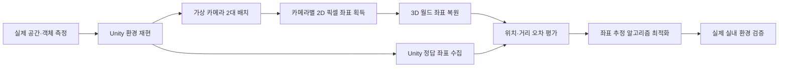

# 두 대의 CCTV를 활용한 실내 객체 3D 좌표 추정

> 실제 실내 공간과 거의 동일하게 구축한 Unity 환경에서 두 카메라의 2D 픽셀 좌표를 3D 월드 좌표로 복원하고, 그 결과가 실제 환경에서도 유효한지 검증하는 프로젝트입니다.

## 목차

- [프로젝트 소개](#프로젝트-소개)
- [연구 범위](#연구-범위)
- [연구 방법](#연구-방법)
- [구현 및 검증 계획](#구현-및-검증-계획)
- [준비물](#준비물)
- [평가 항목](#평가-항목)
- [고려사항](#고려사항)
- [개발 환경](#개발-환경)
- [팀 구성](#팀-구성)

## 프로젝트 소개

단일 CCTV 영상의 2D 픽셀 좌표만으로는 객체의 실제 위치와 거리를 정확히 알기 어렵습니다. 영상에는 원근감이 반영되며, 좌표를 3D 공간으로 복원하려면 카메라의 위치·방향·렌즈 특성과 공간의 물리적 기준이 필요하기 때문입니다.

이 프로젝트는 실제 강의실이나 DIY실의 크기, 카메라 배치, 책상·의자·카트 등의 객체 크기를 측정하여 Unity에 최대한 동일하게 재현합니다. 이후 두 대의 카메라에서 얻은 객체의 2D 픽셀 좌표를 바탕으로 3D 월드 좌표를 계산하고, Unity의 정답 좌표와 비교하여 좌표 추정 알고리즘을 개선합니다. 마지막으로 같은 방법을 실제 실내 공간에 적용해 활용 가능성을 검증합니다.

## 연구 범위

기존의 산업현장 전체 안전 시스템 구현 범위를 줄이고, 다음 문제에 집중합니다.

1. 실제 실내 공간과 거의 동일한 Unity 가상환경 구축
2. 두 카메라의 2D 픽셀 좌표를 이용한 3D 월드 좌표 복원
3. 좌표 추정 알고리즘의 오차 분석 및 최적화
4. 다양한 크기의 실제 실내 공간과 객체를 이용한 재현성 검증

객체 탐지, PPE 착용 판별, 충돌 위험도 및 TTC 계산은 현재 핵심 연구 범위에서 제외하거나 좌표 추정이 안정화된 이후의 확장 과제로 다룹니다.

## 연구 방법

```mermaid
flowchart LR
    A[실제 공간·객체 측정] --> B[Unity 환경 재현]
    B --> C[가상 카메라 2대 배치]
    C --> D[카메라별 2D 픽셀 좌표 획득]
    D --> E[3D 월드 좌표 복원]
    B --> F[Unity 정답 좌표 수집]
    E --> G[위치·거리 오차 평가]
    F --> G
    G --> H[좌표 추정 알고리즘 최적화]
    H --> I[실제 실내 환경 검증]
```

### 1. 실제 환경 측정 및 Unity 재현

- 강의실, DIY실 등 실내 공간의 가로·세로·높이를 측정합니다.
- 책상, 의자, 카트 등 실험 대상 객체의 크기와 배치를 측정합니다.
- 필요한 경우 사진 측량 또는 3D 스캔을 통해 객체의 형태를 재현합니다.
- Unity에서는 임의로 축소하지 않고 기본적으로 `1 Unity unit = 1 m`를 적용합니다.
- 부득이하게 축척을 적용할 경우 공간, 객체, 카메라 위치를 동일한 비율로 변환하고 실제 단위로 환산할 수 있도록 축척값을 기록합니다.

### 2. 두 카메라를 이용한 3D 좌표 복원

- 두 카메라의 내부 파라미터와 위치·회전 등 외부 파라미터를 구합니다.
- 두 영상에서 동일한 객체의 대응점을 찾고 2D 픽셀 좌표를 수집합니다.
- 스테레오 기하와 삼각측량을 이용해 3D 월드 좌표를 계산합니다.
- 연속 프레임을 사용할 경우 속도 계산 방법은 수학적 검토와 자문을 거쳐 결정합니다.

### 3. 실제 환경 검증

- Unity에서 계산한 좌표와 정답 월드 좌표를 비교해 알고리즘을 보정합니다.
- 동일한 카메라 배치와 측정 기준을 실제 공간에 적용합니다.
- 크기가 다른 강의실과 DIY실에서 성능 변화를 확인합니다.
- 의자, 카트, 책상 등 크기와 형태가 다른 객체로 반복 실험합니다.

## 구현 및 검증 계획

| 단계 | 주요 작업 | 결과물 |
| --- | --- | --- |
| 환경 조사 | 실제 공간·객체·카메라 배치 측정 | 치수표, 배치도, 촬영 기준 |
| Unity 구축 | 실측값을 반영한 공간과 객체 구현 | 실제 환경 대응 가상환경 |
| 카메라 설정 | 가상·실제 카메라 캘리브레이션 | 내부·외부 파라미터 |
| 좌표 복원 | 두 영상의 대응점으로 3D 좌표 계산 | 추정 월드 좌표 |
| 알고리즘 개선 | Unity 정답 좌표와 오차 비교 | 최적화된 좌표 추정 방식 |
| 현장 검증 | 다양한 공간과 객체에서 반복 측정 | 환경별 오차 및 재현성 분석 |

## 준비물

| 준비물 | 수량 | 주요 조건 | 용도 |
| --- | :---: | --- | --- |
| 장거리 줄자 | 1개 이상 | 측정 길이 10 m 이상 | 공간, 객체 및 카메라 간 거리 측정 |
| CCTV 또는 네트워크 카메라 | 2대 | Wi-Fi 연결 및 영상 획득 가능, 가능하면 동일 모델 | 서로 다른 시점의 영상과 2D 좌표 획득 |
| 장축 셀카봉 또는 카메라 지지대 | 2개 | 필요한 CCTV 높이까지 설치 가능 | 카메라 높이와 촬영 각도 고정 |

구매·대여 전에는 카메라의 해상도, 프레임레이트, 렌즈 화각, 영상 저장·스트리밍 방식, 타임스탬프 또는 동기화 가능 여부와 지지대의 최대 높이·하중·고정 방식을 추가로 확인합니다.

## 평가 항목

| 평가 항목 | 측정 내용 |
| --- | --- |
| 좌표 정확도 | Unity 정답 대비 3D 위치 오차와 축별 오차 |
| 거리 정확도 | 객체 간 실제 거리 대비 추정 거리 오차 |
| 환경 일반화 | 공간 크기와 카메라 배치 변화에 따른 오차 |
| 객체 일반화 | 의자, 카트, 책상 등 객체 종류에 따른 오차 |
| 안정성 | 반복 측정 및 연속 프레임에서의 좌표 변동 |

## 고려사항

- 실제 카메라의 렌즈 왜곡과 Unity 가상 카메라의 차이
- 두 실제 카메라의 프레임 동기화
- 카메라 설치 높이·각도·기준점 측정 오차
- 두 영상에서 동일 객체 또는 동일 특징점을 대응시키는 방법
- 객체 가림, 조명 변화, 반사 및 모션 블러
- Unity 환경과 실제 환경 사이의 형상·재질 차이

## 개발 환경

Unity에서 실측 기반 가상환경과 두 대의 카메라를 구성합니다. 좌표 복원 알고리즘과 실험 데이터 처리는 Python 기반으로 구현할 예정입니다.

기업 멘토가 제공한 Ubuntu 24.04 실습 서버는 데이터 처리와 알고리즘 개발·검증에 활용할 수 있습니다. 접속 정보와 인증 정보는 README에 공개하지 않으며 팀 내부 보안 채널로 공유합니다.

## 팀 구성

| 구분 | 이름 | 주요 역할 |
| --- | --- | --- |
| 학부생 | 김근찬 | AI 탐지 모델 및 좌표 추정 |
| 학부생 | 조해민 | 시스템 연동 및 데이터 처리 |
| 학부생 | 서성윤 | Unity 가상환경 및 결과 시각화 |
| 대학원생 | 양영준·박주환·김채현 | 프로젝트 자문 및 협업 |
| 기업 멘토 | 손희문 부장 | 산업현장 환경 자료 및 요구사항 자문 |

> 세부 역할은 구현 범위와 프로젝트 진행 상황에 따라 조정될 수 있습니다.
