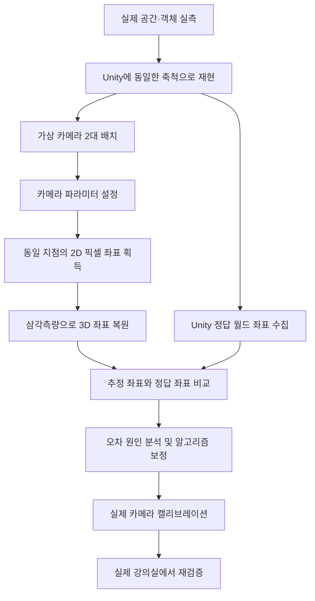

# 두 대의 CCTV를 활용한 실내 객체 3D 좌표 추정

> 실제 실내 공간과 거의 동일하게 구축한 Unity 환경에서 두 카메라의 2D 픽셀 좌표를 3D 월드 좌표로 복원하고, 그 결과가 실제 환경에서도 유효한지 검증하는 프로젝트입니다.

## 목차

- [프로젝트 소개](#프로젝트-소개)
- [연구 목적](#연구-목적)
- [연구 범위](#연구-범위)
- [관련 연구 및 차별성](#관련-연구-및-차별성)
- [Unity 환경이 필요한 이유](#unity-환경이-필요한-이유)
- [연구 방법](#연구-방법)
- [실험 설계](#실험-설계)
- [준비물](#준비물)
- [평가 항목](#평가-항목)
- [고려사항](#고려사항)
- [진행 현황](#진행-현황)
- [전체 일정](#전체-일정)
- [개발 환경](#개발-환경)
- [팀 구성](#팀-구성)

## 프로젝트 소개

단일 CCTV 영상의 2D 픽셀 좌표만으로는 객체의 실제 위치와 거리를 정확히 알기 어렵습니다. 서로 다른 깊이에 있는 객체가 영상에서는 비슷한 위치에 나타날 수 있고, 카메라에서 멀어질수록 객체가 작게 보이기 때문입니다. 따라서 픽셀 좌표를 실제 3D 좌표로 변환하려면 공간의 물리적 기준과 카메라의 특성 및 설치 정보를 알아야 합니다.

이 프로젝트는 실제 강의실이나 DIY실의 크기, 카메라 배치, 책상·의자·카트 등의 객체 크기를 측정하여 Unity에 최대한 동일하게 재현합니다. 이후 두 대의 카메라에서 얻은 객체의 2D 픽셀 좌표를 바탕으로 3D 월드 좌표를 계산하고, Unity의 정답 좌표와 비교하여 좌표 추정 알고리즘을 개선합니다. 마지막으로 같은 방법을 실제 실내 공간에 적용해 활용 가능성을 검증합니다.

## 연구 목적

이 연구의 핵심 목적은 **두 대의 CCTV 영상에 나타난 동일 지점의 2D 픽셀 좌표로 실제 공간의 3D 위치를 얼마나 정확하게 복원할 수 있는지 확인하는 것**입니다.

구체적으로 다음 질문에 답하고자 합니다.

1. 카메라의 내부·외부 파라미터와 물리적 기준점을 이용하면 2D 픽셀 좌표를 어느 정도 정확도로 3D 좌표로 복원할 수 있는가?
2. 카메라 간 거리, 설치 높이와 촬영 각도가 좌표 오차에 어떤 영향을 미치는가?
3. Unity에서 최적화한 좌표 복원 방법이 실제 강의실에서도 유사한 정확도를 보이는가?
4. 공간의 크기와 객체의 종류가 달라져도 동일한 방법을 적용할 수 있는가?

## 연구 범위

기존의 산업현장 전체 안전 시스템 구현 범위를 줄이고, 다음 문제에 집중합니다.

1. 실제 실내 공간과 거의 동일한 Unity 가상환경 구축
2. 두 카메라의 2D 픽셀 좌표를 이용한 3D 월드 좌표 복원
3. 좌표 추정 알고리즘의 오차 분석 및 최적화
4. 다양한 크기의 실제 실내 공간과 객체를 이용한 재현성 검증

객체 탐지는 좌표 변환에 사용할 객체의 2D 위치(bbox)를 얻는 용도로 사용합니다. 객체 추적, 이동 속도 계산과 거리 기반 위험 판정은 좌표 변환 정확도를 확인한 뒤 순서대로 확장합니다. PPE 착용 판별과 TTC 계산은 현재 연구 범위에서 제외합니다.

## 관련 연구 및 차별성

본 연구는 카메라 캘리브레이션, 영상 간 대응점 검출과 스테레오 삼각측량을 기반으로 합니다. Zhang의 평면 패턴 기반 캘리브레이션 방법을 이용해 카메라 내부 파라미터와 렌즈 왜곡을 추정하고, Hartley와 Sturm의 삼각측량 연구를 바탕으로 두 영상의 대응점에서 3D 좌표를 복원합니다. 초기 실험에서는 ArUco 마커를 사용해 두 카메라에서 동일한 지점을 안정적으로 식별합니다.

기존 다중 카메라 연구가 사람·차량의 검출과 추적 성능 향상에 주로 집중한 것과 달리, 본 연구는 **두 대의 일반 CCTV만을 사용하여 카메라 배치 조건에 따른 3D 좌표 오차를 분석**합니다. 실제 공간을 동일한 축척으로 구현한 Unity에서 정답 좌표를 확보하고, 가상환경에서 검증한 방법을 실제 강의실과 DIY실에 적용한다는 점에서 차이가 있습니다.

| 관련 연구 | 본 연구에서의 활용 |
| --- | --- |
| Zhang, *A Flexible New Technique for Camera Calibration* (2000) | ChArUco 기반 내부 파라미터 및 렌즈 왜곡 추정 |
| Hartley & Sturm, *Triangulation* (1997) | 두 영상의 대응점을 이용한 3D 좌표 복원 |
| Garrido-Jurado et al., *Automatic Generation and Detection of Highly Reliable Fiducial Markers under Occlusion* (2014) | ArUco 마커 기반 기준점 식별 |
| Chavdarova et al., *WILDTRACK* (2018) | 다중 CCTV의 월드 좌표 기반 객체 위치 평가 참고 |
| Borkman et al., *Unity Perception* (2021) | Unity 기반 정답 데이터 생성과 가상환경 실험 설계 참고 |

세부 논문은 [Zhang의 카메라 캘리브레이션](https://doi.org/10.1109/34.888718), [Hartley와 Sturm의 삼각측량](https://doi.org/10.1006/cviu.1997.0547), [ArUco 마커 연구](https://doi.org/10.1016/j.patcog.2014.01.005), [WILDTRACK](https://arxiv.org/abs/1707.09299), [Unity Perception](https://arxiv.org/abs/2107.04259)을 참고합니다.

## Unity 환경이 필요한 이유

실제 환경에서는 카메라와 객체의 정확한 3D 좌표를 지속적으로 측정하기 어렵기 때문에 알고리즘의 계산 결과가 맞는지 반복적으로 확인하기 어렵습니다. 반면 Unity에서는 모든 객체와 카메라의 위치·회전값을 정답 데이터로 바로 얻을 수 있습니다.

Unity 환경은 다음 목적으로 사용합니다.

- 실제 공간과 같은 크기의 통제된 실험 환경 구성
- 카메라 위치·높이·각도를 일정한 간격으로 변경하는 반복 실험
- 객체의 정답 월드 좌표 자동 수집
- 추정 좌표와 정답 좌표의 정량적인 오차 비교
- 실제 공간에서 수행하기 어려운 다양한 배치 조건의 사전 검증

현재는 강의실과 DIY실의 좌우 벽면 길이와 높이를 실측하여 Unity 환경을 구축하고 있습니다. 이후 실제 산업현장의 설계도 정보를 확보할 수 있다면, 설계도를 바탕으로 현장 공간을 Unity에 재현해 같은 방법을 적용하는 것도 검토합니다.

Unity가 실제 환경을 완전히 대신하는 것은 아닙니다. Unity에서 알고리즘의 기본 원리와 오차 요인을 확인한 뒤, 실제 카메라의 렌즈 왜곡·동기화·조명·가림 등이 포함된 현장 실험으로 결과를 다시 검증합니다.

## 연구 방법

```mermaid
flowchart TD
    A[실제 공간·객체 실측] --> B[Unity에 동일한 축척으로 재현]
    B --> C[가상 카메라 2대 배치]
    C --> D[카메라 파라미터 설정]
    D --> E[동일 지점의 2D 픽셀 좌표 획득]
    E --> F[삼각측량으로 3D 좌표 복원]
    B --> G[Unity 정답 월드 좌표 수집]
    F --> H[추정 좌표와 정답 좌표 비교]
    G --> H
    H --> I[오차 원인 분석 및 알고리즘 보정]
    I --> J[실제 카메라 캘리브레이션]
    J --> K[실제 강의실에서 재검증]
```

### 1. 실제 환경 측정 및 Unity 재현

- 강의실, DIY실 등 실내 공간의 가로·세로·높이를 측정합니다.
- 책상, 의자, 카트 등 실험 대상 객체의 크기와 배치를 측정합니다.
- 필요한 경우 사진 측량 또는 3D 스캔을 통해 객체의 형태를 재현합니다.
- Unity에서는 임의로 축소하지 않고 기본적으로 `1 Unity unit = 1 m`를 적용합니다.
- 부득이하게 축척을 적용할 경우 공간, 객체, 카메라 위치를 동일한 비율로 변환하고 실제 단위로 환산할 수 있도록 축척값을 기록합니다.

### 2. 카메라 캘리브레이션

- 실제 카메라는 ChArUco 보드를 여러 위치와 각도에서 촬영합니다.
- 초점거리, 주점과 렌즈 왜곡계수 등 각 카메라의 내부 파라미터를 계산합니다.
- 두 카메라 사이의 회전과 이동 관계인 외부 파라미터를 계산합니다.
- Unity 카메라도 실제 카메라의 해상도와 화각에 맞춰 설정합니다.
- 다음 스크립트를 OpenCV로 작성합니다.
  - ChArUco 보드 생성 스크립트
  - 카메라 캘리브레이션 스크립트 (`cv2.calibrateCamera`)
  - ArUco 마커 검출 스크립트

| 구분 | 용도 |
| --- | --- |
| ChArUco | 체스보드와 ArUco 마커를 결합한 보드로, 15~30장을 촬영해 초점거리와 왜곡계수 등 내부 파라미터 계산 |
| ArUco | 바닥 등 알려진 위치에 배치해 외부 파라미터를 계산하고, 좌표 변환 결과의 오차를 검증하는 기준점으로 사용 |

### 3. 두 카메라를 이용한 3D 좌표 복원

- 두 영상에서 동일한 객체의 대응점을 찾고 2D 픽셀 좌표를 수집합니다.
- 초기 실험에서는 ID를 구분할 수 있는 ArUco 마커를 기준점으로 사용합니다.
- 스테레오 기하와 삼각측량을 이용해 3D 월드 좌표를 계산합니다.
- 복원한 좌표와 Unity 또는 실측 정답 좌표의 차이를 계산합니다.
- 1차 구현으로 객체가 바닥 평면 위에 있다고 가정하는 `pixel_to_world()` 함수를 작성하고, YOLO 탐지 결과(bbox)와 연결해 정지 객체로 테스트합니다.
- ArUco 마커 검증 데이터로 좌표 변환 오차를 cm 단위로 수치화합니다.

### 4. 객체 탐지

- YOLO11 COCO 사전학습 모델을 사용합니다.
- 사람과 의자는 COCO 클래스로 바로 인식할 수 있습니다.
- 책상과 마트 카트는 직접 수집한 데이터로 파인튜닝하여 인식합니다.
- 실제 산업현장의 지게차 등은 촬영이 어려우므로 의자·카트·책상을 대체 객체로 사용합니다.

### 5. 객체 추적, 속도 계산과 위험 판정

- ByteTrack으로 프레임 간 객체 ID를 유지하고 같은 객체의 시간별 좌표를 기록합니다.
- `(현재 좌표 - 이전 좌표) / 시간차`로 이동 속도를 계산합니다.
- 이동 촬영 영상의 계산 결과를 줄자·스톱워치 또는 알려진 이동거리와 비교합니다.
- 객체 간 거리 임계값을 기준으로 위험 여부를 판정합니다.

### 6. 실제 환경 검증

- Unity에서 계산한 좌표와 정답 월드 좌표를 비교해 알고리즘을 보정합니다.
- 동일한 카메라 배치와 측정 기준을 실제 공간에 적용합니다.
- 크기가 다른 강의실과 DIY실에서 성능 변화를 확인합니다.
- 의자, 카트, 책상 등 크기와 형태가 다른 객체로 반복 실험합니다.

## 실험 설계

| 단계 | 실험 내용 | 확인할 사항 |
| --- | --- | --- |
| 1. 실측 | 공간, 객체와 카메라 설치 위치 측정 | Unity 모델과 실제 환경의 치수 일치 여부 |
| 2. 가상환경 구축 | 실측값을 `1 Unity unit = 1 m`로 반영 | 공간·객체·카메라의 축척 일치 여부 |
| 3. 기준 실험 | 고정된 카메라와 정지 마커로 좌표 복원 | 기본 알고리즘의 좌표 정확도 |
| 4. 조건 변화 실험 | 카메라 간 거리·높이·각도와 객체 위치 변경 | 조건별 오차 변화와 적절한 카메라 배치 |
| 5. 일반화 실험 | 공간 크기와 객체 종류 변경 | 다른 환경에서도 결과가 유지되는지 여부 |
| 6. 실제 환경 실험 | 실제 카메라 보정 후 동일 실험 반복 | Unity 결과와 실제 결과의 차이 |

### 수집 데이터

각 실험에서는 다음 정보를 함께 저장합니다.

- 실험 환경과 프레임을 구분하는 ID
- 두 카메라 영상 또는 이미지
- 두 영상에서 동일 기준점의 2D 픽셀 좌표
- Unity 또는 실측으로 얻은 정답 3D 좌표
- 계산으로 복원한 3D 좌표
- 카메라의 내부·외부 파라미터
- 공간·객체의 치수와 카메라 배치 조건
- 정답 대비 위치·거리 오차

## 준비물

준비물은 실측, 촬영, 카메라 보정과 반복 실험을 위해 사용합니다.

| 구분 | 준비물 | 용도 |
| --- | --- | --- |
| 촬영 | 동일 모델 CCTV 또는 네트워크 카메라 2대 | 서로 다른 시점의 영상과 2D 픽셀 좌표 획득 |
| 설치 | 높이 조절 스탠드와 고정 어댑터 각 2개 | 카메라 위치와 촬영 각도 고정 |
| 실측 | 10m 이상 줄자, 레이저 거리측정기 | 공간·객체·카메라 배치의 실제 치수 측정 |
| 카메라 보정 | A3 ChArUco 출력물과 평평한 폼보드 | 내부 파라미터, 렌즈 왜곡과 카메라 간 관계 계산 |
| 기준점 | 서로 다른 ID의 ArUco 마커 | 두 영상의 동일 지점 식별 및 좌표 검증 |
| 설치 보조 | 수평계, 추, 제거 가능한 바닥 테이프 | 카메라 중심과 원점 표시 및 반복 배치 |
| 저장·연결 | microSD 카드, 전용 공유기, 연장선 | 원본 영상 보존과 안정적인 영상 수신·전원 공급 |

두 카메라는 해상도·렌즈·화각 차이를 줄이기 위해 가능한 한 같은 모델과 하드웨어 버전을 사용합니다. Wi-Fi 카메라는 프레임 단위의 하드웨어 동기화가 어려울 수 있으므로 초기에는 정지 객체를 대상으로 검증하고, 이동 객체 실험 전에는 시간 동기화 방법을 별도로 검토합니다.

## 평가 항목

| 평가 항목 | 측정 내용 |
| --- | --- |
| 좌표 정확도 | Unity 정답 대비 3D 위치 오차와 축별 오차 |
| 거리 정확도 | 객체 간 실제 거리 대비 추정 거리 오차 |
| 환경 일반화 | 공간 크기와 카메라 배치 변화에 따른 오차 |
| 객체 일반화 | 의자, 카트, 책상 등 객체 종류에 따른 오차 |
| 안정성 | 반복 측정 및 연속 프레임에서의 좌표 변동 |

## 고려사항

- 실제 카메라의 렌즈 왜곡과 Unity 가상 카메라의 차이
- 두 실제 카메라의 프레임 동기화
- 카메라 설치 높이·각도·기준점 측정 오차
- 두 영상에서 동일 객체 또는 동일 특징점을 대응시키는 방법
- 객체 가림, 조명 변화, 반사 및 모션 블러
- Unity 환경과 실제 환경 사이의 형상·재질 차이
- 카메라에서 먼 위치의 객체에서 커지는 좌표 오차

## 진행 현황

| 항목 | 상태 |
| --- | --- |
| 산학협력프로젝트 수행계획서 작성·제출 | 완료 |
| 필요 재료 구매 서류 준비·전송 | 진행 중 |
| Unity 환경 구축 (강의실, DIY실) | 진행 중 |
| ChArUco·ArUco 스크립트 작성 및 데이터 촬영 준비 | 진행 중 |
| YOLO11 COCO 모델 파인튜닝 (책상, 마트 카트) | 예정 |

## 전체 일정

전체 기간은 9/29 ~ 10/23(25일)이며, 10/21 중간 발표 자료는 논문 내용과 최대한 겹치게 준비해 중복 작업을 줄입니다.

| 스프린트 | 기간 | 주요 작업 | 목표 |
| --- | --- | --- | --- |
| 1st | 9/29 ~ 10/5 | YOLO11 + ByteTrack 환경 세팅 및 파이프라인 1차 동작 확인, ChArUco 보드 인쇄와 캘리브레이션 스크립트 작성, 촬영 장소 답사·바닥 격자 표시·카메라 거치대 리허설, 대체 객체 배치 계획과 촬영 시나리오 작성 | 다음 주부터 바로 촬영 가능한 상태 |
| 2nd | 10/6 ~ 10/8 | ChArUco 15~30장 촬영으로 내부 파라미터 계산, 대체 객체의 정지·이동 영상 촬영, ArUco 마커로 외부 파라미터 계산, 촬영 데이터 정리·백업 | 좌표 변환·속도 계산용 원본 데이터 전량 확보 |
| 3rd | 10/9 ~ 10/11 | `pixel_to_world()` 구현, YOLO bbox와 좌표 변환 연결, ArUco 검증 데이터로 오차 측정, 정확도 1차 결과 정리 | 픽셀→실제 좌표 변환 정확도를 cm 단위로 제시 |
| 4th | 10/11 ~ 10/14 | ByteTrack 기반 시간별 좌표 기록, 속도 계산 구현, 실측 이동거리와 비교, 거리 임계값 기반 위험 판정 | 위험도 산출까지 엔드투엔드 파이프라인 완성 |
| 5th | 10/15 ~ 10/18 | 전체 파이프라인 오차 정량화, 원거리·가림 등 오차가 큰 사례 분석 및 보완, 논문용 표·그림 정리, 팀 전체 리뷰 | 논문에 넣을 실험 결과 확정 |
| 6th | 10/19 ~ 10/21 | 논문 초안 작성(서론, 관련 연구, 방법론, 실험 결과, 결론), 중간 발표 준비 및 발표(10/21) | 논문 초안 및 중간 발표 완료 |

## 개발 환경

Unity에서 실측 기반 가상환경과 두 대의 카메라를 구성합니다. 좌표 복원 알고리즘과 실험 데이터 처리는 Python 기반으로 구현하며, 카메라 캘리브레이션과 마커 검출은 OpenCV, 객체 탐지는 YOLO11, 객체 추적은 ByteTrack을 사용합니다.

기업 멘토가 제공한 Ubuntu 24.04 실습 서버는 데이터 처리와 알고리즘 개발·검증에 활용할 수 있습니다. 접속 정보와 인증 정보는 README에 공개하지 않으며 팀 내부 보안 채널로 공유합니다.

## 팀 구성

| 구분 | 이름 | 주요 역할 |
| --- | --- | --- |
| 학부생 | 김근찬 | AI 탐지 모델 및 좌표 추정 |
| 학부생 | 조해민 | 시스템 연동 및 데이터 처리 |
| 학부생 | 서성윤 | Unity 가상환경 및 결과 시각화 |
| 대학원생 | 양영준·박주환·김채현 | 프로젝트 자문 및 협업 |
| 기업 멘토 | 손희문 부장 | 산업현장 환경 자료 및 요구사항 자문 |

> 세부 역할은 구현 범위와 프로젝트 진행 상황에 따라 조정될 수 있습니다.
