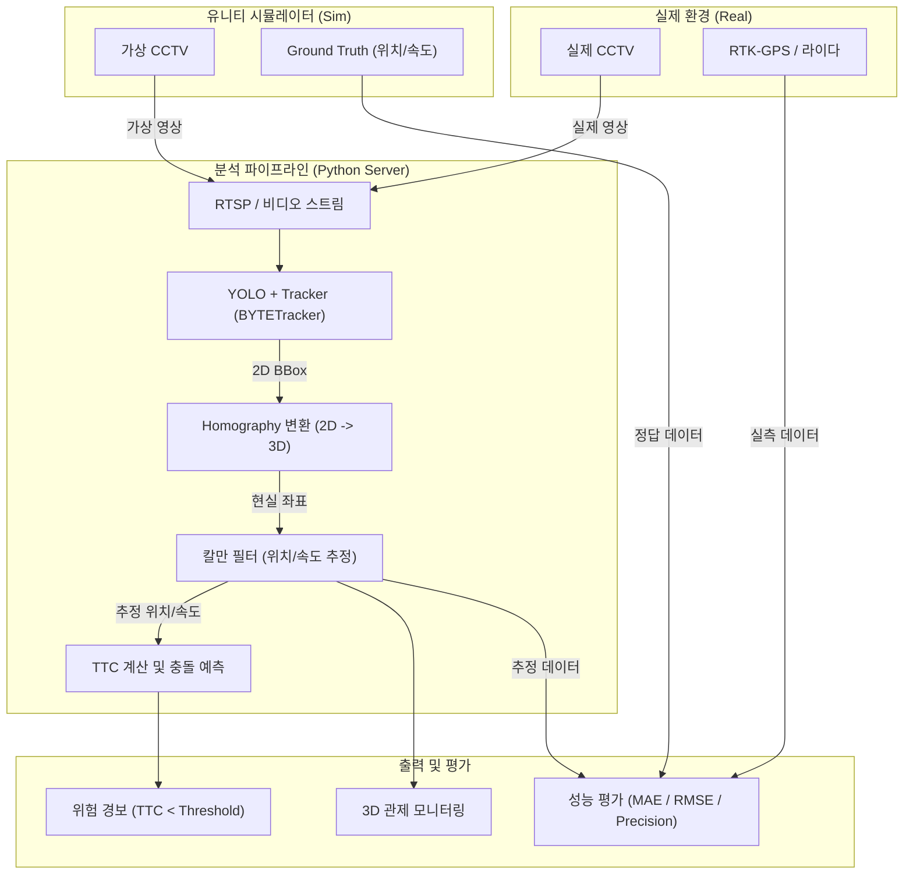

# 2026-09-18 회의록

## 주요 주제

- 제작한 ppt 발표
- 데이터셋과 인프라 구성 방법
- 충돌 감지 로직은 ttc 알고리즘으로 할 것?
- 주요 요구 사항: 시스템 모델 처리 속도(전체 딜레이)와 정확도
- 유니티를 활용한 시스템 모델 개발 방법과 실제 환경과의 비교 방법
- unity 시뮬레이션 내용 넣자 → 객체 인식 내용 빼야할듯

## 다음 할 일

- 유니티에서 현장 시뮬레이션 환경 구축
- 논문 작성을 위한 정확도와 속도 확보
- 데이터 수집 및 전송 통신 방법 검토

---

[클로바노트공유]

회의록 w2
https://clovanote.naver.com/s/3cNdureXWW3trVJShbU8ZoS?t=1033

---

지금으로서는 실제 환경의 실측 데이터가 없네요.